# Task API

A small in-memory CRUD API for managing a to-do list, built with **FastAPI**.

Tasks live only in memory — if you restart the server, the data resets. That's expected for now (no database yet).

---

## 1. What to install

You need Python 3.10+ installed. Then install the two dependencies listed in `requirements.txt`:

```
fastapi==0.139.2
uvicorn==0.51.0
```

Install them with:

```bash
pip install -r requirements.txt
```

## 2. How to run it (one command)

```bash
uvicorn main:app --reload
```

This starts the server at `http://localhost:8000`.

## 3. Where to view the API

Open your browser at:

```
http://localhost:8000/docs
```

This is **Swagger UI** — an interactive page that lists every endpoint and lets you test them with a "Try it out" button, no `curl` needed.

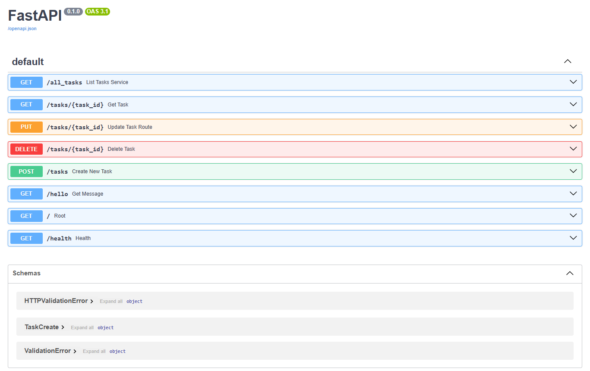

---

## Step-by-step: checking each endpoint

Below is every endpoint, in the order you'd naturally test them, with how to run it and what response to expect. First the "is it alive?" routes, then the full CRUD cycle (Create, Read, Update, Delete).

### Step 1 — `GET /` (Root)

**What it does:** confirms the server is up and shows basic info about the API.

**How to run it:**
```bash
curl -i http://localhost:8000/
```

**Expected response:** status `200 OK` with the API's name, version, and list of endpoints.

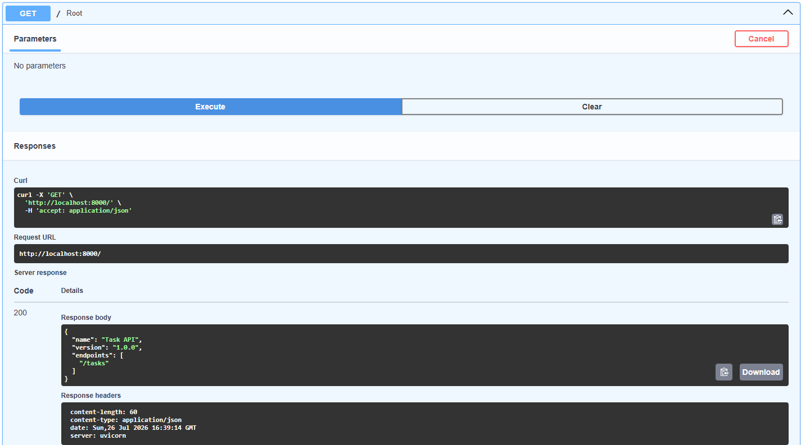

---

### Step 2 — `GET /health` (Health check)

**What it does:** a simple check real companies use to confirm the server is alive.

**How to run it:**
```bash
curl -i http://localhost:8000/health
```

**Expected response:** status `200 OK` with `{"status": "ok"}`.

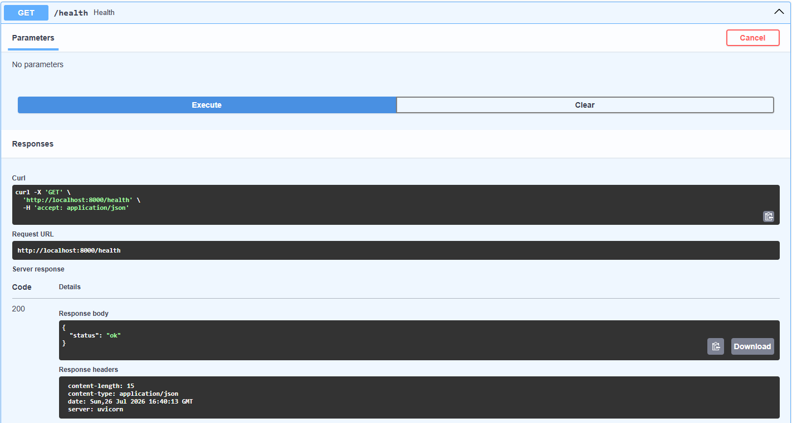

---

### Step 3 — `GET /hello` (Sample message)

**What it does:** returns a simple greeting message, just to test a basic route.

**How to run it:**
```bash
curl -i http://localhost:8000/hello
```

**Expected response:** status `200 OK` with `{"message": "Hello World!"}`.

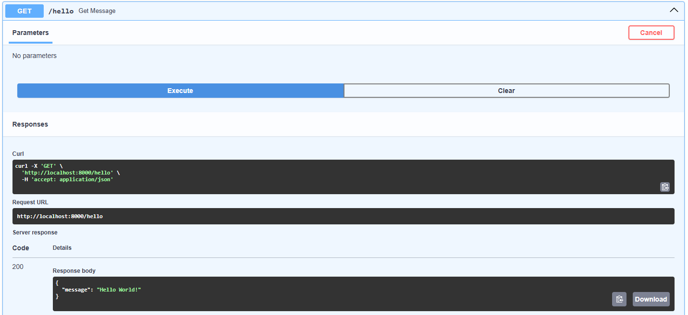

---

### Step 4 — `GET /all_tasks` (List all tasks — Read)

**What it does:** returns every task currently stored.

**How to run it:**
```bash
curl -i http://localhost:8000/all_tasks
```

**Expected response:** status `200 OK` with a list (array) of task objects, each with `id`, `title`, and `done`.

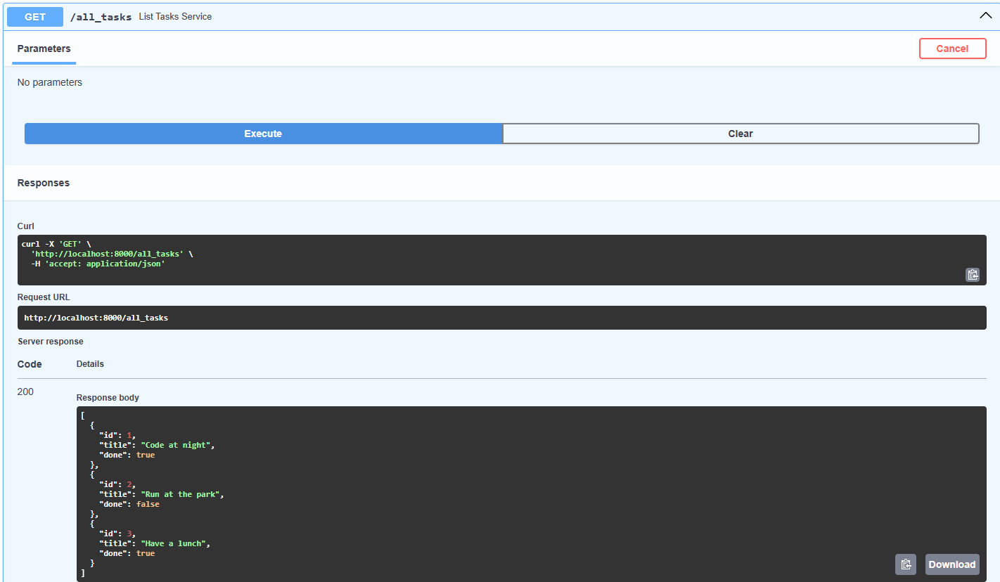

---

### Step 5 — `GET /tasks/{task_id}` (Get one task — Read)

**What it does:** returns a single task by its id.

**How to run it:**
```bash
curl -i http://localhost:8000/tasks/1
```

**Expected response (task exists):** status `200 OK` with that task's data.


**What if the id doesn't exist:**
```bash
curl -i http://localhost:8000/tasks/99
```

**Expected response (task missing):** status `404 Not Found` with an error message telling you the task wasn't found.

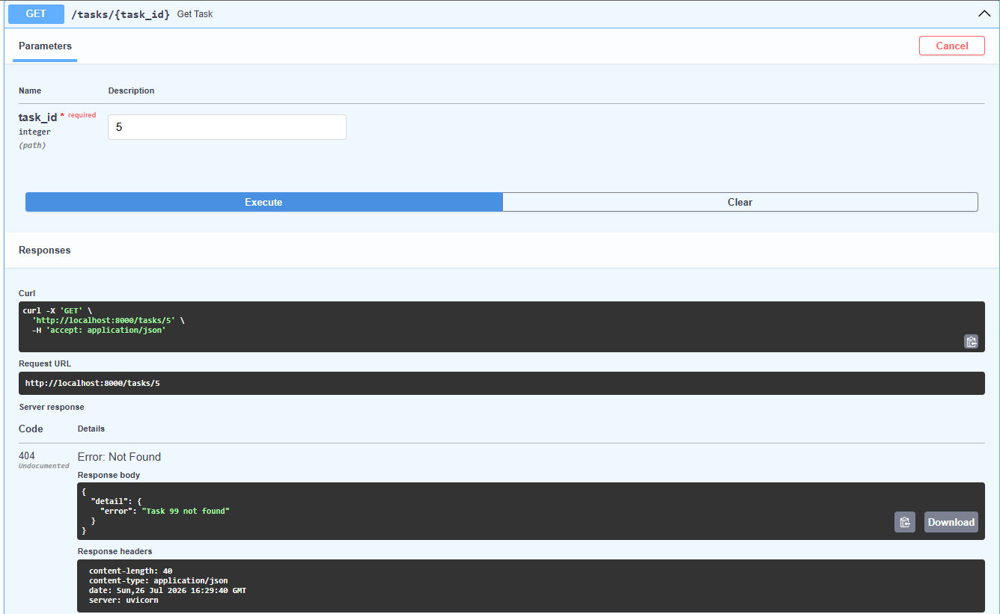

---

### Step 6 — `POST /tasks` (Create a task)

**What it does:** creates a new task from the JSON you send in the request body.

**How to run it:**
```bash
curl -i -X POST http://localhost:8000/tasks \
  -H "Content-Type: application/json" \
  -d '{"title": "Buy a milk."}'
```

**Expected response:** status `201 Created` with the new task, including its generated `id` and `done: false`.


**What if the title is missing or empty:**
```bash
curl -i -X POST http://localhost:8000/tasks \
  -H "Content-Type: application/json" \
  -d '{"title": ""}'
```

**Expected response:** status `400 Bad Request` — the server rejects it and explains that the title is required. This is a validation rule: the server never trusts the client blindly.

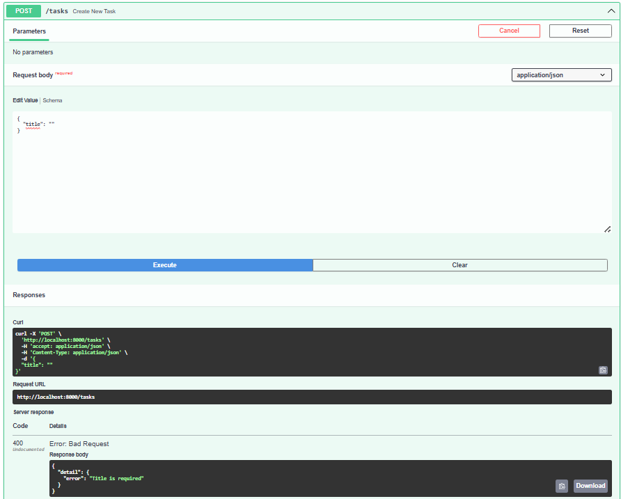

---

### Step 7 — `PUT /tasks/{task_id}` (Update a task)

**What it does:** changes the title and/or done status of an existing task.

**How to run it:**
```bash
curl -i -X PUT http://localhost:8000/tasks/1 \
  -H "Content-Type: application/json" \
  -d '{"title": "Have a great meal."}'
```

**Expected response (task exists):** status `200 OK` with the updated task.

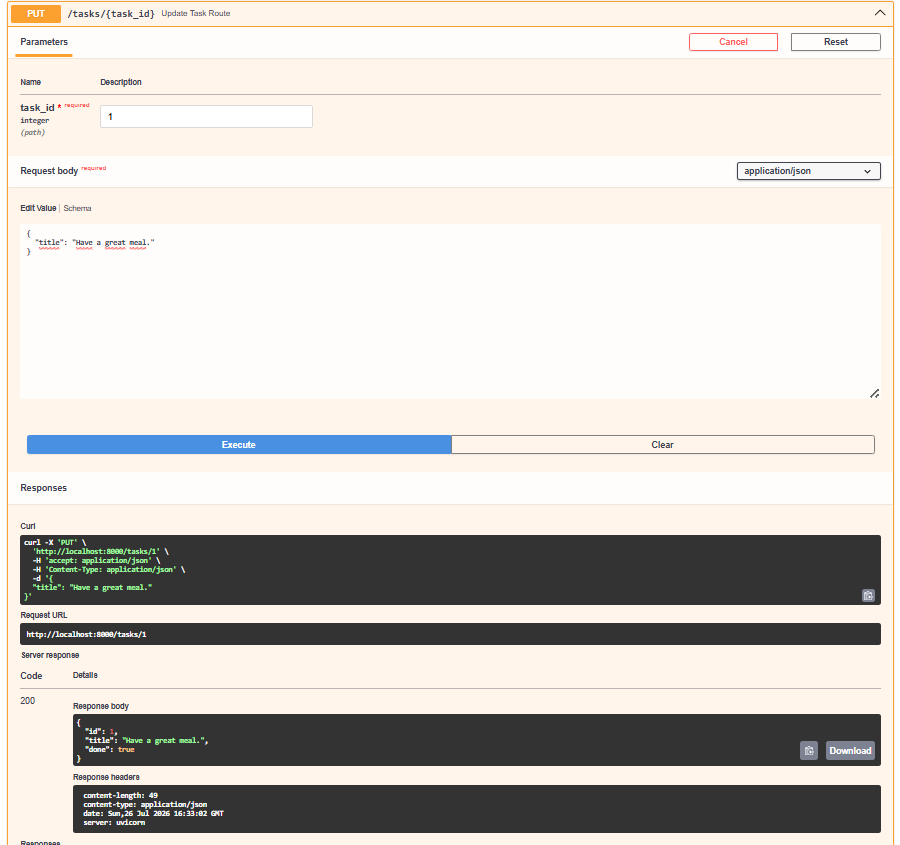

**What if the id doesn't exist:**
```bash
curl -i -X PUT http://localhost:8000/tasks/99 \
  -H "Content-Type: application/json" \
  -d '{"title": "Have a great meal."}'
```

**Expected response:** status `404 Not Found`.

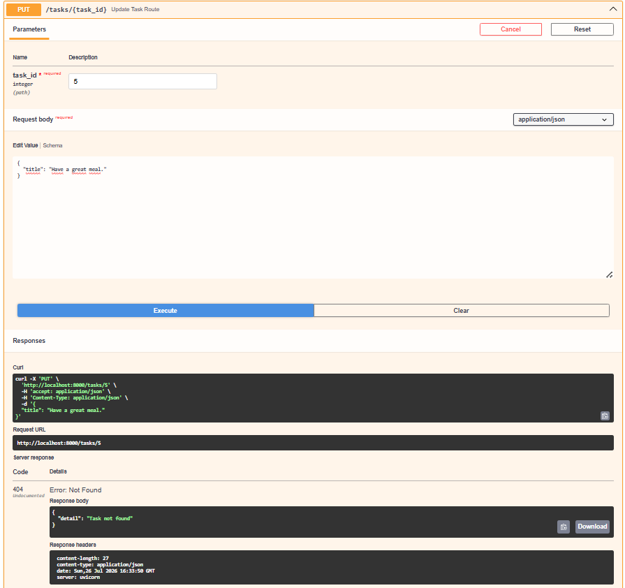

---

### Step 8 — `DELETE /tasks/{task_id}` (Delete a task)

**What it does:** removes a task from the list.

**How to run it:**
```bash
curl -i -X DELETE http://localhost:8000/tasks/1
```

**Expected response (task exists):** status `204 No Content` — success, with an empty body.

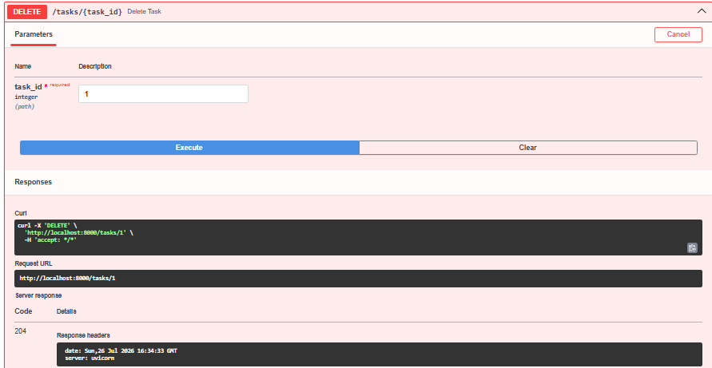

**What if the id doesn't exist:**
```bash
curl -i -X DELETE http://localhost:8000/tasks/99
```

**Expected response:** status `404 Not Found`.

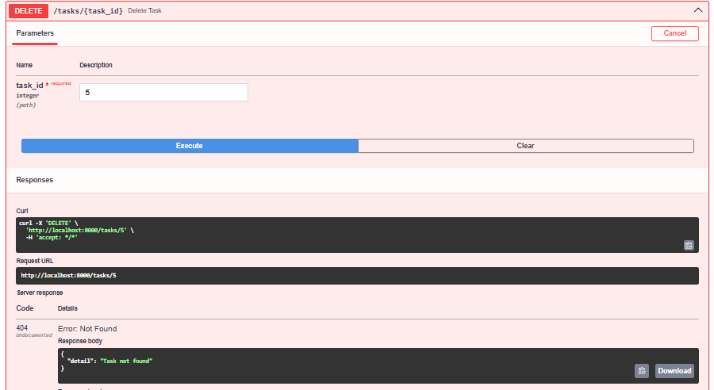

---

## Endpoint summary

| Method | Path | What it does | Success status | Error status |
|--------|------|---------------|-----------------|---------------|
| GET | `/` | API info | 200 | — |
| GET | `/health` | Health check | 200 | — |
| GET | `/hello` | Sample message | 200 | — |
| GET | `/all_tasks` | List all tasks | 200 | — |
| GET | `/tasks/{task_id}` | Get one task | 200 | 404 if not found |
| POST | `/tasks` | Create a task | 201 | 400 if title missing/empty |
| PUT | `/tasks/{task_id}` | Update a task | 200 | 404 if not found |
| DELETE | `/tasks/{task_id}` | Delete a task | 204 | 404 if not found |
